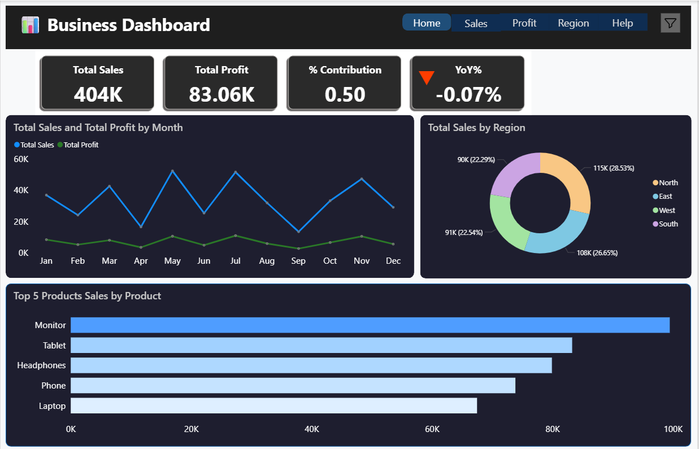
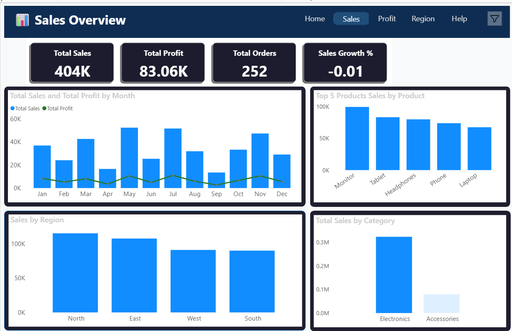
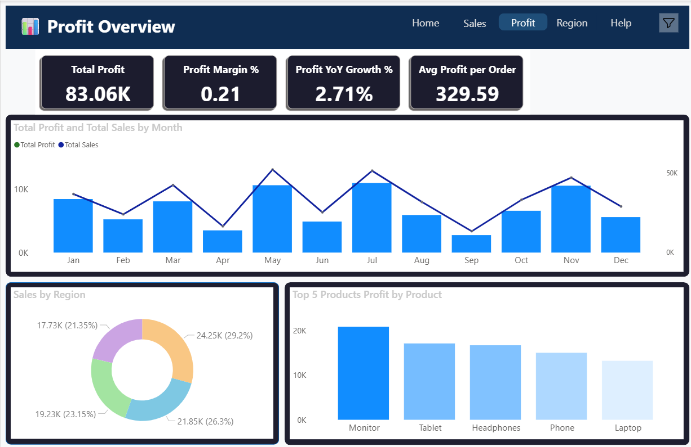
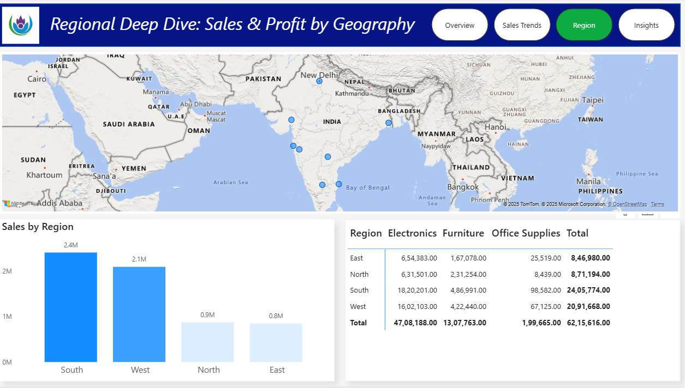
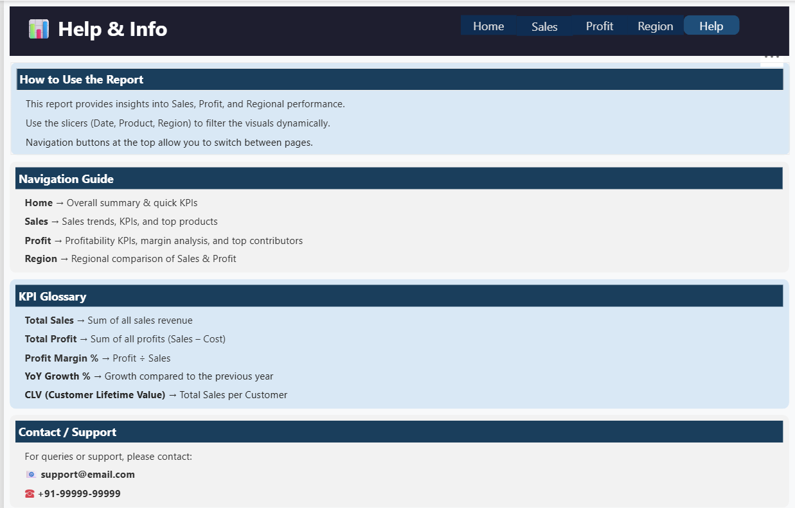

# Executive Scorecard Dashboard (Dark Theme + Page Navigation)

📅 **Period:** 2024–2025  
🛠️ **Tool:** Power BI  

---

## 🎯 Objective
To create a **CEO-style Scorecard Dashboard** that summarizes key performance indicators (KPIs) — Sales, Profit, and Customer Insights — with professional **dark theme design** and **page navigation using bookmarks** for a seamless experience.

---

## 🧩 Key Highlights
- 🎨 **Dark Theme Dashboard:** Modern look with high contrast visuals  
- 🧭 **Page Navigation via Bookmarks:** Switch between summary, sales, and customer view smoothly  
- 💡 **Dynamic KPIs:** Total Sales, Profit %, Quantity, Customer Count  
- 📊 **Interactive Charts:** Category vs Region, Top 5 Products, and Trend Analysis  
- 🔍 **Filters:** Region and Date slicers for on-demand analysis  
- 🧱 **Design Focus:** Minimal, clean, and easy to present to management

---

## ⚙️ Power BI Concepts Used
- Bookmarks and Buttons for Page Navigation  
- KPI Cards and Conditional Formatting  
- DAX for Dynamic Measures  
- Consistent Dark Theme Layout  
- Drill-through & Tooltip Interactions  

---

## 🧠 Sample DAX Used

Total Sales = SUM(Sales[Amount])

Total Profit = SUM(Sales[Profit])

Profit % = DIVIDE([Total Profit], [Total Sales])

Top 5 Products =
TOPN(
    5,
    ADDCOLUMNS(
        VALUES(Sales[Product]),
        "SalesAmount", [Total Sales]
    ),
    [SalesAmount], DESC
)

## Preview

Home Page

Sales Page

Profit Page

Region Page

Help Page

