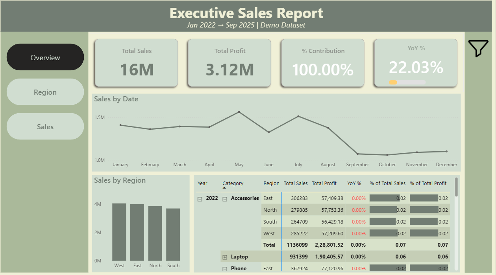

# Executive Sales Report (Light Theme)

📅 **Period:** Jan 2022 – Sep 2025  
🛠️ **Tool:** Power BI  

---

## 🎯 Objective
To design a **clean and minimalist executive dashboard** that tracks key business metrics — Sales, Profit, Contribution %, and YoY Growth %.  
The goal was to create a presentation-friendly dashboard using a **soft light theme** and **page navigation buttons** for clear storytelling.

---

## 🧩 Key Highlights
- 💼 **Executive Summary View:** Focused KPIs for management  
- 🎨 **Light Theme Design:** Calm pastel background for clear readability  
- 🔢 **KPI Cards:** Total Sales, Profit, % Contribution, and YoY %  
- 📉 **YoY Growth Indicator:** Conditional formatting for decline/improvement  
- 🧭 **Page Navigation Buttons:** Switch between Overview, Region, and Sales views  
- 📊 **Charts:** Sales Trend by Month, Sales by Region, and Detailed Table  

---

## ⚙️ Power BI Concepts Used
- DAX Measures for KPIs and YoY calculations  
- Page Navigation using Bookmarks and Buttons  
- Conditional Formatting on KPI visuals  
- Consistent light color palette using JSON theme  
- Visual hierarchy for presentation clarity  

---

## 🧠 Sample DAX Used

Total Sales = SUM(Sales[Amount])

Total Profit = SUM(Sales[Profit])

% Contribution = DIVIDE([Total Profit], [Total Sales])

YoY % =
VAR CurrSales = [Total Sales]
VAR PrevSales =
    CALCULATE([Total Sales], SAMEPERIODLASTYEAR('Calendar'[Date]))
RETURN
DIVIDE(CurrSales - PrevSales, PrevSales)

## Preview

