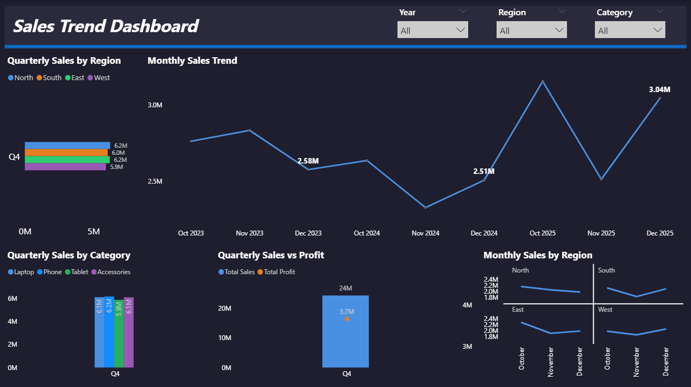

# Sales Trend Dashboard (Dark Theme)

📅 **Period:** Oct 2023 – Dec 2025  
🛠️ **Tool:** Power BI  

---

## 🎯 Objective
To visualize **sales and profit trends** over time — identifying patterns across **months, quarters, regions, and product categories.**  
This dashboard helps in understanding business seasonality and region-based performance shifts.

---

## 🧩 Key Highlights
- 📈 **Monthly & Quarterly Sales Trends:** Line chart tracking sales momentum  
- 🌎 **Regional Breakdown:** Compare performance across North, South, East, and West  
- 💰 **Sales vs Profit Comparison:** Identify profit efficiency by quarter  
- 🧭 **Dynamic Filters:** Year, Region, and Category slicers for on-demand analysis  
- 🎨 **Dark Theme:** Consistent with executive dashboards for professional visuals  

---

## ⚙️ Power BI Concepts Used
- Line, Bar, and Combo charts  
- Small Multiples visualization for regional trend comparison  
- Dynamic filtering with slicers  
- Custom dark theme JSON for visual consistency  
- DAX measures for total sales and profit calculations  

---

## 🧠 Sample DAX Used

Total Sales = SUM(Sales[Amount])

Total Profit = SUM(Sales[Profit])

Sales Growth % =
VAR CurrSales = [Total Sales]
VAR PrevSales =
    CALCULATE(
        [Total Sales],
        DATEADD('Calendar'[Date], -1, MONTH)
    )
RETURN
DIVIDE(CurrSales - PrevSales, PrevSales)

## Preview

