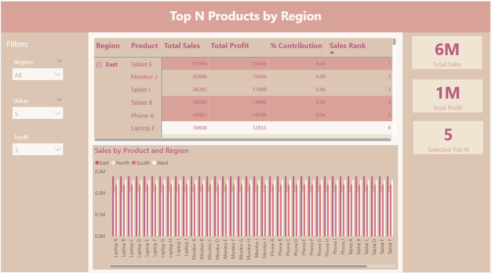
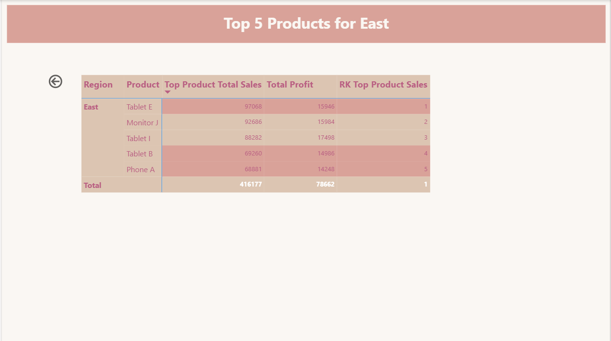

# Ranking and Top N Dashboard

📅 **Project Date:** 2025  
🛠️ **Tool:** Power BI  

---

## 🎯 Objective
To analyze **Top N performing products** by region, using **RANKX** and **DAX-based dynamic measures**.  
This project demonstrates practical applications of ranking, filtering, and measure optimization for performance dashboards.

---

## 🧩 Key Highlights
- 🧮 **Dynamic Ranking:** Display Top 3 or Top 5 products using slicer input  
- 🗺️ **Regional View:** Ranking of products across multiple regions  
- ⚙️ **RANKX Logic:** Calculates product position dynamically based on sales or profit  
- 🎛️ **Parameter-Based Top N:** Controlled via slicer for flexible ranking depth  
- 📊 **Visual Insights:** Highlights top contributors and bottom performers  

---

## ⚙️ Power BI Concepts Used
- RANKX function for dynamic sorting  
- TOPN and FILTER combinations  
- SWITCH function for metric selection  
- DAX variables for optimized computation  
- Interaction between visuals and slicers  

---

## 🧠 Sample DAX Used
DAX
Total Sales = SUM(Sales[Amount])

Rank by Sales =
RANKX(
    ALLSELECTED(Sales[Product]),
    [Total Sales],
    ,
    DESC,
    DENSE
)

Top N Products =
VAR SelectedN = SELECTEDVALUE('TopN'[Value], 5)
RETURN
TOPN(SelectedN, ALL(Sales[Product]), [Total Sales], DESC)

## Preview

Main

TopN Drill through

