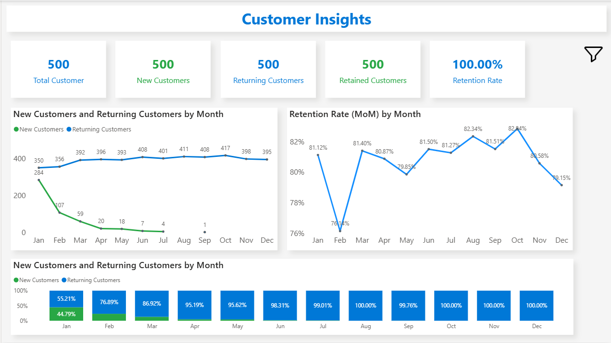

# Customer Insights Dashboard

📅 **Project Date:** 2025  
🛠️ **Tool:** Power BI  

---

## 🎯 Objective
To analyze **customer behavior and retention patterns**, identifying:
- New vs Returning Customers  
- Retention and Churn Rates  
- Purchase Frequency Trends  
- Lifetime Value (CLV)

This dashboard provides a full customer analytics view to help businesses understand loyalty and revenue contribution.

---

## 🧩 Key Highlights
- 👥 **Customer Segmentation:** New, Returning, and Lost customers  
- 💰 **Lifetime Value (CLV):** Total sales generated per customer  
- 📊 **Retention Rate:** Monthly customer retention trend  
- 🔄 **Customer Activity Trends:** Visualizes frequency and gap between purchases  
- 🎨 **Professional Layout:** Consistent theme and color logic  

---

## ⚙️ Power BI Concepts Used
- CALCULATE, FILTER, DISTINCTCOUNT, and DAX variables  
- Virtual tables for customer trend analysis  
- Retention and churn calculation logic  
- Advanced measures for CLV and repeat customers  
- Slicers and bookmarks for time-based analysis  

---

## 🧠 Sample DAX Used

Total Customers = DISTINCTCOUNT(Sales[CustomerID])

New Customers = 
CALCULATE (
    DISTINCTCOUNT ( Sales[CustomerID] ),
    FILTER (
        Sales,
        Sales[OrderDate] =
            CALCULATE (
                MIN ( Sales[OrderDate] ),
                ALLEXCEPT ( Sales, Sales[CustomerID] )
            )
    )
)

Returning Customers =
[Total Customers] - [New Customers]

## Preview

