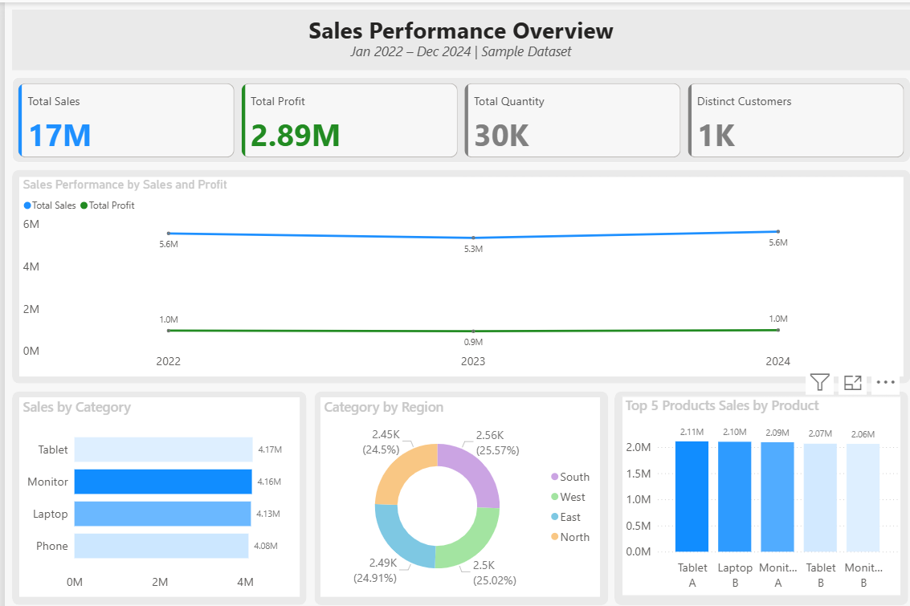
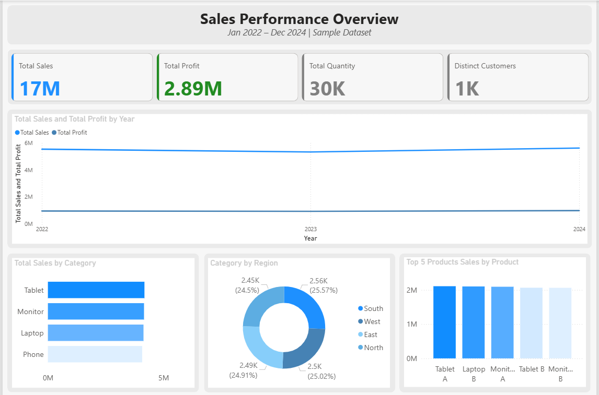

# Themes and Backgrounds in Power BI

📅 **Project Date:** 2025  
🛠️ **Tool:** Power BI  

---

## 🎯 Objective
To explore and master **Power BI design customization**, focusing on:
- Light theme creation
- JSON theme files
- Transparent backgrounds
- PowerPoint layout integration

This project demonstrates how visual design can improve **clarity, engagement, and storytelling** in Power BI dashboards.

---

## 🧩 Key Highlights
- 🎨 **Custom Themes:** Created JSON-based color palettes for Light and Dark dashboards  
- 🧱 **Background Design:** Used PowerPoint for layout design and imported as background  
- ✨ **Transparent Tables & Cards:** Enhanced readability and visual flow  
- 💡 **Typography & Consistency:** Maintained professional spacing, font style, and alignment  
- 🧭 **Modern Dashboard Feel:** Created corporate-ready UI design  

---

## ⚙️ Power BI Concepts Used
- JSON Theme file integration  
- Page background and transparency customization  
- Color harmonization for visuals  
- PowerPoint-based layout design  
- Consistent visual hierarchy  

---

## 🧠 Notes
This project focuses purely on **visual design principles** — not data analysis.  
It serves as a template base for all future dashboards with **consistent color branding and layout**.

---

## 🖼️ Dashboard Preview

