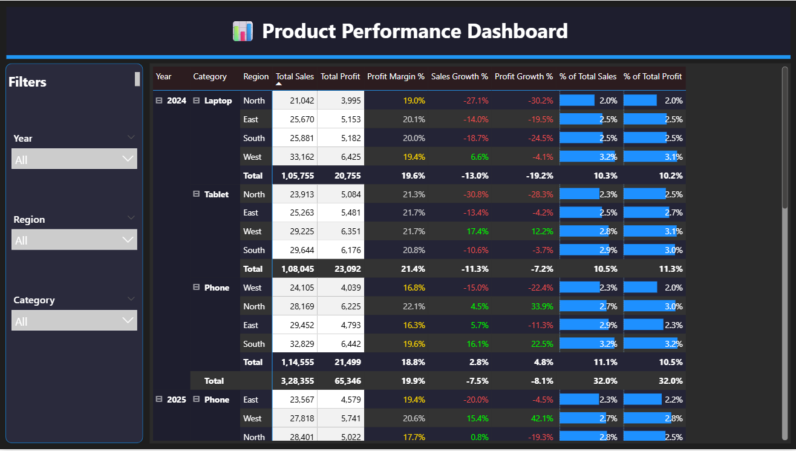

# Product Performance Dashboard (Dark Theme)

📅 **Period:** 2023–2024  
🛠️ **Tool:** Power BI  

---

## 🎯 Objective
To analyze **sales and profit performance** of products across regions and years, highlighting **growth percentage, profit margin**, and **contribution metrics**.  
This dashboard helps management identify top-performing categories and track year-over-year changes.

---

## 🧩 Key Highlights
- 🧭 **Dark Mode UI:** Clean, modern layout for easy reading  
- 💹 **Matrix View:** Shows detailed breakdown by *Year → Category → Region*  
- 📊 **Growth Analysis:** Displays *Sales Growth %* and *Profit Growth %* with color-coded performance indicators  
- 🧮 **KPI Metrics:** Profit Margin %, % of Total Sales, and % of Total Profit  
- 🎛️ **Interactive Filters:** Year, Region, and Category filters for quick insights  

---

## ⚙️ Power BI Concepts Used
- Matrix visualization with conditional formatting  
- DAX measures for growth and margin analysis  
- Dark theme customization using JSON  
- Power Query for data transformation  
- Slicers for interactivity and usability  

---

## 🧠 Sample DAX Used

Total Sales = SUM(Sales[Amount])

Total Profit = SUM(Sales[Profit])

Profit Margin % = DIVIDE([Total Profit], [Total Sales])

Sales Growth % =
VAR CurrSales = [Total Sales]
VAR PrevSales =
    CALCULATE(
        [Total Sales],
        SAMEPERIODLASTYEAR('Calendar'[Date])
    )
RETURN
DIVIDE(CurrSales - PrevSales, PrevSales)

## Preview

