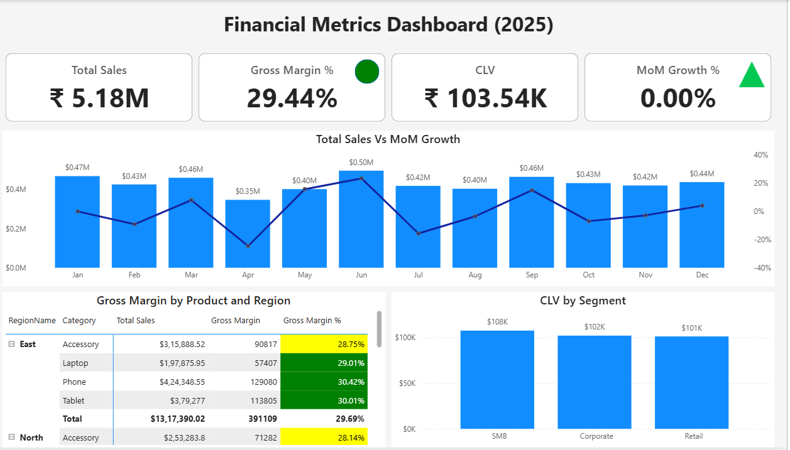
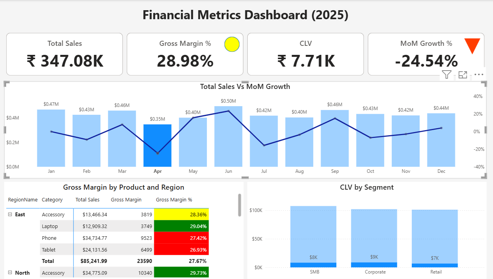

# Financial Metrics Dashboard

📅 **Project Date:** 2025  
🛠️ **Tool:** Power BI  

---

## 🎯 Objective
To analyze **key financial metrics** such as Sales, Profit, Growth %, and Customer Lifetime Value (CLV) to track business performance.  
This dashboard provides an executive-level overview of profitability, efficiency, and financial health across time periods.

---

## 🧩 Key Highlights
- 💰 **KPIs:** Total Sales, Total Profit, % Growth, and CLV  
- 📈 **YoY Growth Analysis:** Tracks sales and profit percentage growth trends  
- 🧮 **Financial Ratios:** Profit Margin % and Contribution %  
- 📊 **Dynamic Visuals:** Visual comparisons of actual vs previous year metrics  
- 💡 **Clean Design:** Corporate dark theme with readable KPIs  

---

## ⚙️ Power BI Concepts Used
- DAX calculations for growth and margin ratios  
- Time Intelligence functions (DATEADD, SAMEPERIODLASTYEAR)  
- KPI visual formatting  
- Variable-based optimization for DAX performance  
- Theme consistency and executive-level presentation  

---

## 🧠 Sample DAX Used

Total Sales = SUM(Sales[Amount])

Total Profit = SUM(Sales[Profit])

Profit Margin % = DIVIDE([Total Profit], [Total Sales])

Sales Growth % =
VAR CurrSales = [Total Sales]
VAR PrevSales =
    CALCULATE(
        [Total Sales],
        SAMEPERIODLASTYEAR('Calendar'[Date])
    )
RETURN
DIVIDE(CurrSales - PrevSales, PrevSales)

## Preview

