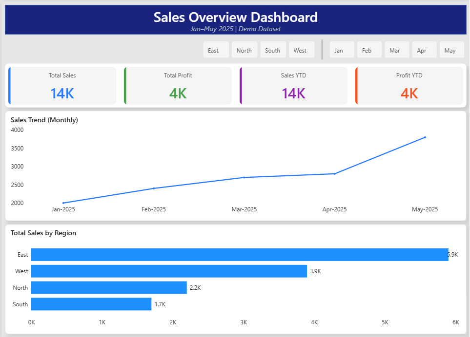
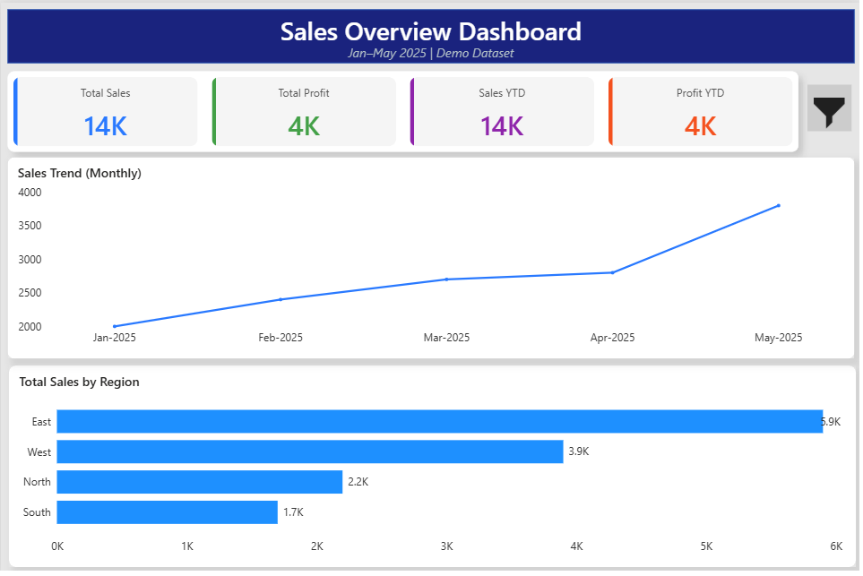

# Sales Overview Dashboard

📅 **Period:** Jan–May 2025  
📊 **Tools Used:** Power BI, DAX, Power Query  

## 🧠 Objective
To analyze sales and profit trends across regions and categories, providing a quick overview of business performance.

## 🧩 Key Features
- KPI Cards: Total Sales, Total Profit, Sales YTD, Profit YTD  
- Trend Line: Monthly sales trend with slicer filters  
- Regional Breakdown: Bar chart of sales by region  
- Filter Panel: Dynamic button to filter by month and region  

## 🧰 DAX Highlights
- `Total Sales = SUM(Sales[Amount])`  
- `Sales YTD = TOTALYTD([Total Sales], 'Date'[Date])`  
- `Profit % = DIVIDE([Total Profit], [Total Sales])`

## 🎨 Design Notes
- Clean and minimal theme  
- Consistent card colors for metrics  
- Interactive filters for better storytelling  

🖼️ **Dashboard Preview:**  

