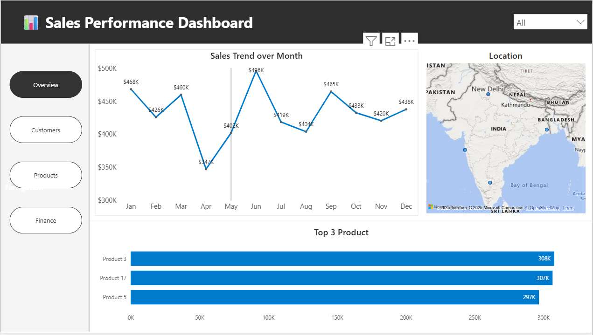
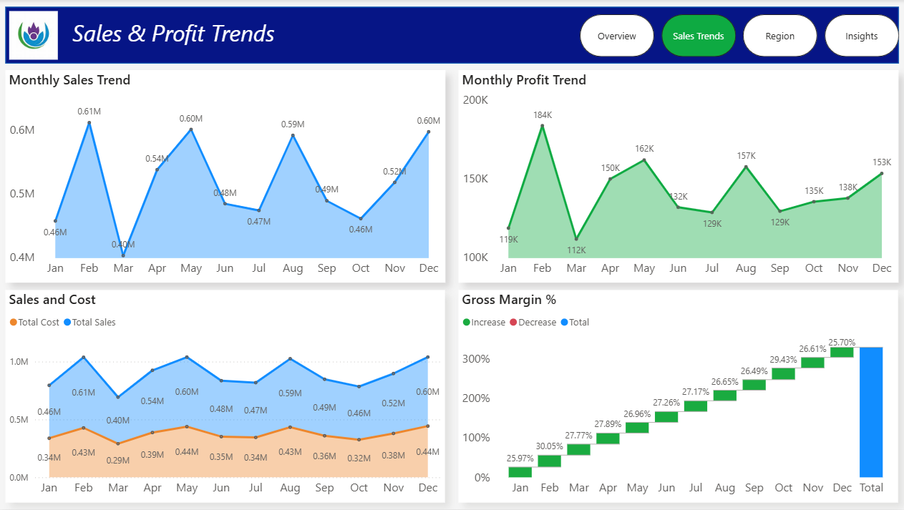
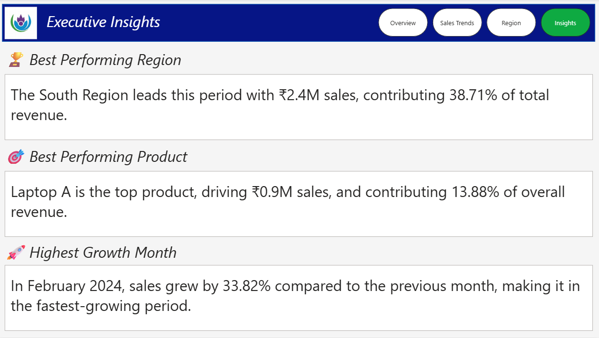

# Executive Insights Dashboard

📅 **Project Date:** 2025  
🛠️ **Tool:** Power BI  

---

## 🎯 Objective
To design a **comprehensive executive dashboard** that combines key business KPIs, regional trends, and product-level insights in a single professional report.  
The dashboard is built for **CXO-level decision making**, highlighting sales growth, profitability, and performance contribution.

---

## 🧩 Key Highlights
- 💼 **One-Page Executive Summary:** Clean, high-impact visualization for management review  
- 🧭 **Multi-KPI Scorecard:** Sales, Profit, Growth %, Margin %, and Contribution %  
- 🌍 **Regional & Category Breakdown:** Drill-through options for region and product views  
- 🔄 **Dynamic Filtering:** Switch between metrics and time periods effortlessly  
- 🎨 **Corporate Dark Theme:** Elegant layout designed for presentation and storytelling  

---

## ⚙️ Power BI Concepts Used
- Complex DAX measures with time intelligence  
- Dynamic KPIs and toggle buttons  
- Context transition using CALCULATE and variables  
- Drillthroughs and bookmarks for deeper exploration  
- Optimized model design following Star Schema principles  

---

## 🧠 Sample DAX Used
DAX
Total Sales = SUM(Sales[Amount])

Total Profit = SUM(Sales[Profit])

Profit Margin % = DIVIDE([Total Profit], [Total Sales])

Sales YoY Growth % =
VAR CurrSales = [Total Sales]
VAR PrevSales =
    CALCULATE([Total Sales], SAMEPERIODLASTYEAR('Calendar'[Date]))
RETURN
DIVIDE(CurrSales - PrevSales, PrevSales)

## Preview

Overview

Sales Trend

Region

Insight

