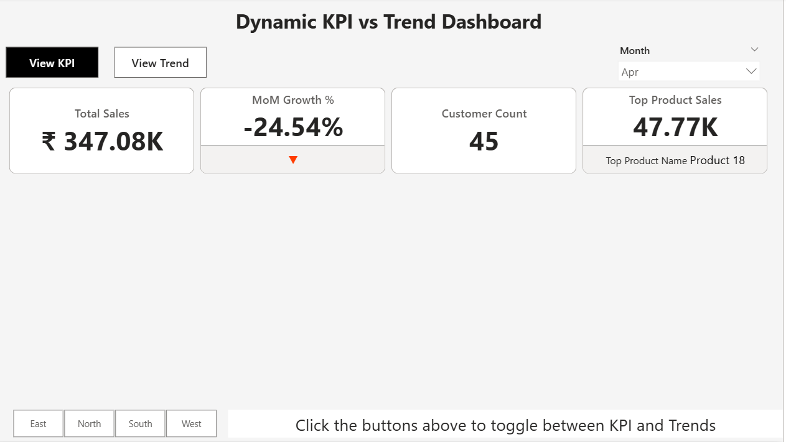
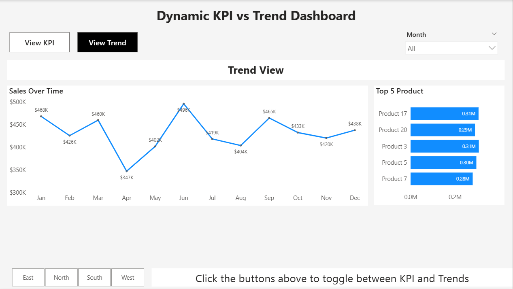

# Dynamic Toggle Dashboard

📅 **Project Date:** 2025  
🛠️ **Tool:** Power BI  

---

## 🎯 Objective
To build a **dynamic and interactive dashboard** that allows users to toggle between **different KPI views and chart visuals** using bookmarks and buttons — improving storytelling and report usability.

---

## 🧩 Key Highlights
- 🔄 **Toggle Buttons:** Switch between KPI View, Trend View, and Category View dynamically  
- 🧭 **Bookmarks:** Used to capture and control visibility of visuals  
- 🧠 **Dynamic Insights:** Same report page, multiple perspectives  
- 🎨 **Minimalist Design:** Clean layout with consistent dark theme  
- ⚙️ **Navigation Logic:** Built fully inside Power BI without external scripts  

---

## ⚙️ Power BI Concepts Used
- **Bookmarks and Selections Pane** for visual toggling  
- **Buttons and Actions** for navigation  
- **Dynamic Title Measures** (changes with selection)  
- **Page Navigation and Interaction Handling**  
- **KPI & Trend Visuals in one canvas**  

---

## 🧠 Sample DAX Used

IsButton1Selected = 
IF(
    SELECTEDVALUE(ButtonTable[ButtonName]) = "Button1",
    1,
    0
)

SelectedButton1Color = IF ( SELECTEDVALUE(ButtonTable[ButtonName]) = "Button1", "#000000" , "#118DFF")

## Preview

KPI Vieew

Trend View

