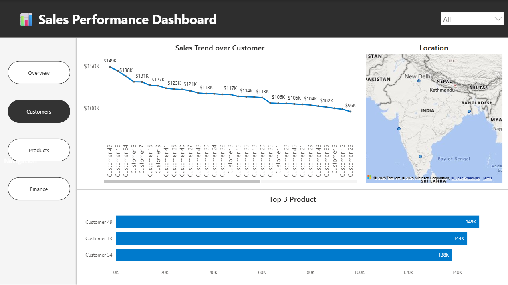
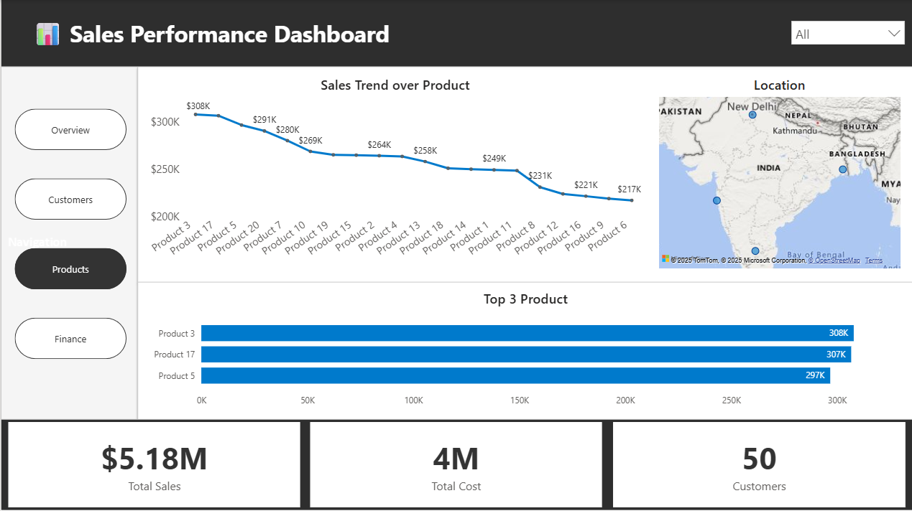
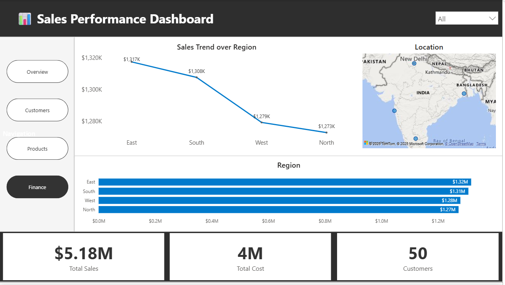

# PowerPoint-Styled Dashboard (Minimalist Design)

📅 **Project Date:** 2025  
🛠️ **Tool:** Power BI  

---

## 🎯 Objective
To create a **presentation-style Power BI dashboard** inspired by PowerPoint/Figma layouts — blending professional design with analytical storytelling.  
The goal was to make an **executive-friendly dashboard** that feels like a corporate slide deck.

---

## 🧩 Key Highlights
- 🖼️ **PPT-Inspired Layout:** Created layout using PowerPoint and imported into Power BI  
- 🎨 **Clean & Minimal Design:** Focused on readability, spacing, and alignment  
- 💡 **Executive View:** Displays only the most relevant business KPIs and visuals  
- 🔘 **Consistent Theme:** Used subtle background color and rounded visual containers  
- 📊 **Professional Presentation Style:** Looks ready-to-present without any additional editing  

---

## ⚙️ Power BI Concepts Used
- Custom background design via PowerPoint  
- KPI cards and trend visuals with consistent margins  
- Minimal slicer use for clean storytelling  
- Alignment and spacing optimization  
- Focus on UX/UI best practices  

---

## 🧠 Design Steps
1. Designed background in **PowerPoint** (using rectangles, titles, and icons)  
2. Exported as an image and used it as a **page background** in Power BI  
3. Placed visuals within defined layout zones  
4. Applied consistent font family and color palette  

---

## 🧠 Sample DAX Used

Total Sales = SUM(Sales[Amount])

Total Profit = SUM(Sales[Profit])

Profit % = DIVIDE([Total Profit], [Total Sales])

## Preview

